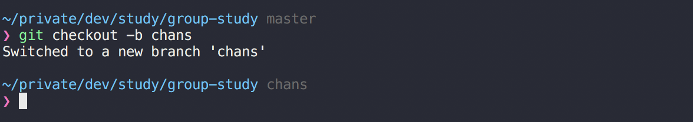
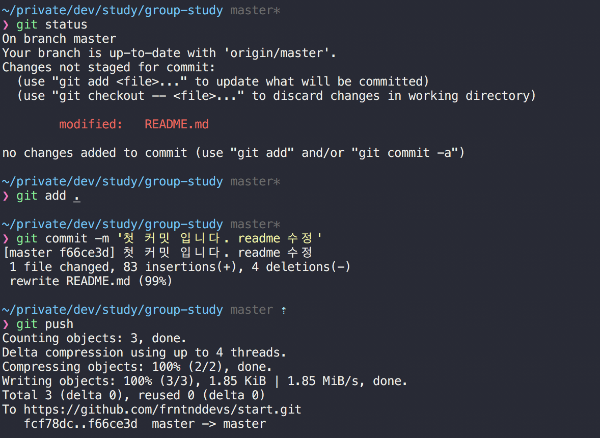

# 마크다운 문법 작성방법
마크다운 문법 작성방법은 [마크다운 치트시트](https://github.com/adam-p/markdown-here/wiki/Markdown-Cheatsheet)를 참고하면 됩니다.

마크다운 문법은 기존 에디터로도 작성 가능!! 

## 저장소 사용법
### git clone을 합니다.
우리의 저장소는 [깃허브 저장소 study](https://github.com/frntnddevs/study) 입니다
개인 pc에 저장소를 설치할 폴더로 이동합니다. 해당 폴더 위치에서 command(터미널)를 엽니다.   

``` bash
git clone https://github.com/frntnddevs/study.git
```
깃 저장소 클론 완료! 해당 폴더에서 작업을 하면 됩니다.

>**주의사항!**   
>master 브랜치는 되도록 건들지 않는게 좋습니다 ㅇㅅㅇ  
>우리는 스터디 용으로 따로 브랜치를 생성해서 작업하도록 합시다!!

### 개인 브랜치 만들기
저장소 안에 개인 폴더를 하나 만든다고 생각하면 쉽습니다.



``` bash
git checkout -b __myname

// 예
// git checkout -b chanspark
```
'__myname'은 자신의 브랜치명입니다. 위의 코드를 입력하면 study 저장소 안에 master 브랜치와 똑같은 파일들을 갖고 있는 브랜치가 생성되고, 자동으로 그 브랜치로 checkout 하게 됩니다.

>**추천**  
>추천드리는 방법은, 이 브랜치에 본인이 필요하다고 생각되는 파일들 (리셋 파일이나, 뭐 특정 파일들..??)을 미리 업로드 해놓고 스터디 주제 작성 전 초기화 브랜치 상태로 만들어 놓으면 편할것 같습니다. 그렇게 될경우 새로운 스터디 주제를 만들때 깃 저장소 클론 -> 내 브랜치로 이동 -> 내 브랜치를 바탕으로 스터디 주제 브랜치 생성 -> 스터디 주제 브랜치 작성 완료 -> 새로운 주제를 만드려면 다시 반복.(깃 저장소 클론...)
  
-----

>**추천2**
>위의 방법과는 다르게 계속 checkout -b 명령어를 사용하면서 브랜치를 생성하는 방법도 있습니다.

### git 커밋, git 푸쉬하기
자신의 브랜치를 생성하고, 해당 브랜치로 이동하였다면 마음껏 코드를 작성하고 커밋을 날릴 수 있습니다.



``` bash
git status
// 현재 깃 파일들의 상태를 알려주는 명령어, 이거로 현재 브랜치를 확인할 수도 있습니다
// 보통 수정된 파일은 빨간색, 깃에 add된 파일은 파란색으로 나옴

git add .
// . 뒤의 쩜은 '모든'파일을 선택해서 깃에 add 한다는 뜻
// 따로 파일명을 적어줄수도 있음

git commit -m '커밋 메시지를 적은다'
// 커밋을 합니다. 커밋은 자주하는게 좋습니다.

git push
// 커밋을 해야지 푸쉬를 해서 원격저장소(깃허브 저장소)에 올릴 수 있습니다.
// 푸쉬는 자주 할 필요가 없습니다.
// 커밋 백번때리고 최종 푸쉬 한번만해도 무관함.

// 주의!! 자신의 브랜치를 최초로 만들었다면, 다른 방법으로 푸시해야합니다.
// 'branch name'에 자신의 브랜치명을 적습니다.
git push -u origin <branch name>

```

파일을 수정할경우, 위의 커맨드를 반복해야함. 

>**주의사항!**  
>만약 특정 파일을 수정한 상태에서 브랜치 이동이나 이전 커밋으로 되돌리기를 하고 싶다면, 수정된 내용을 이전 커밋과 동일하게 되돌리거나 무조건 커밋을 해야합니다. 


### 스터디 주제별 브랜치 만들기
자신이 스터디한것은 [study](https://github.com/frntnddevs/study) 저장소에 커밋하면 됩니다.  
스터디 하는 내용(주제) 하나당 브랜치를 하나씩 만들어서 커밋해주세요. 
모든 스터디 내용 주제는 lecture 폴더 안에 넣어주세요.  
예시) 주제: Git, 작성자: 찬스 == `chans-git`


``` bash
// 위의 명령어대로 현재 브랜치 위치는 내 브랜치에 있는 상태.

git checkout -b lecture/chans-git

```

위의 브랜치를 만들었으면, 로컬에서 원하는 것을 다 하면 됩니다. (모든 파일을 다 삭제하고, 자신만의 프로젝트를 만든다던지...)  
왜냐하면 다른 브랜치 (심지어 마스터브랜치도) 이 브랜치에 영향을 주지 않기 때문이죠!! (머지만 안한다면야)  

따로 README.md파일을 생성해서 마크다운으로 공부한 내용들을 정리하면 되겠습니다.  
스터디 시간에는 각자가 저장소에 접근해서 readme.md 파일을 읽거나 클론받아서 코드를 보며 설명을 들을 수 있습니다.  
이력서에 한줄 넣을 수도 있고요. 이 깃 저장소를 보여주면서 말이죠. ㅇㅅㅇ  
자신이 어떤 주제를 공부할지는 미리미리 알려주도록 합시단.  
파탱파탱~~~ 


